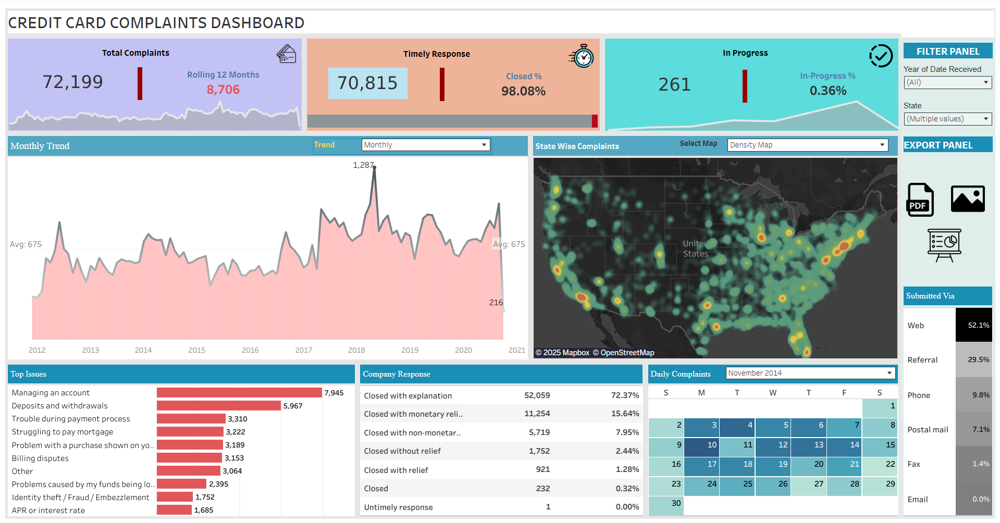

# 💳 Credit Card Complaints Dashboard

## Overview
This project presents an interactive dashboard analyzing credit card complaints collected over multiple years across the United States.
The dashboard provides key metrics on total complaints, timely resolutions, issue categories, and geographic distribution to help financial institutions monitor customer service performance and improve complaint handling strategies.

Built using Tableau, this project transforms raw complaints data into actionable insights.

## Quick Preview

| Home Tab |
| :------: | 
|  | 

## 📚 Domain Knowledge: Why Credit Card Complaint Analysis Matters
Credit card companies face heavy scrutiny from regulators like the Consumer Financial Protection Bureau (CFPB) and consumers alike.
Analyzing complaint data allows financial institutions to:

Detect systemic problems early (e.g., billing errors, fraud)

Ensure regulatory compliance to avoid fines

Improve customer service processes

Reduce churn and enhance brand loyalty

> Fact: According to the CFPB, complaints about credit cards remain among the top 5 most commonly reported financial issues annually.

## 📅 Dataset Description
Time Period: 2012 - 2020

Key Variables:

Date of Complaint Received

Issue Type (Managing Account, Deposits/Withdrawals, etc.)

Company Response (Closed with Explanation, Monetary Relief, etc.)

Method of Submission (Web, Phone, Referral, etc.)

Status (Closed, In Progress)

State of Complaint Origin

## Dashboard Insights
🔥 General Metrics
Total Complaints: 72,199

Rolling 12-Month Complaints: 8,706

Timely Response Rate: 98.08%

Complaints Still in Progress: 261 (0.36%)

📊 Trends and Distributions
Monthly Trend:
The complaint volume fluctuated with peaks around 2017 (highest at 1,287 complaints/month).

Top Issues Reported:

Managing an account (7,945 complaints)

Deposits and withdrawals

Trouble during payment process

Struggling to pay mortgage

Billing disputes

State-wise Distribution: Complaints were densely concentrated in states like California, Texas, and Florida.

Submission Method:

Web: 52.1%

Referral: 29.5%

Phone: 9.8%

Postal mail, Fax, Email (Minor shares)

Company Response Types:

72.37% of complaints closed with explanation.

15.64% closed with monetary relief.

## Technologies Used
Tableau Public/Desktop (for visualization)

Excel/CSV (for initial data preparation)

Mapbox (for density mapping)

## Business Recommendations
Focus on account management support, as it generates the highest number of complaints.

Increase staff training for billing disputes and deposit/withdrawal handling.

Improve resolution time further, especially for cases still in progress.

Analyze states with higher complaint rates to strengthen regional operations.

## Conclusion
The Credit Card Complaints Dashboard provides a powerful view into customer dissatisfaction trends, helping financial organizations:

Identify operational bottlenecks

Improve customer care

Ensure regulatory compliance

Enhance reputation management

Through timely responses and addressing key pain points, companies can significantly reduce complaint volumes and boost customer trust.

